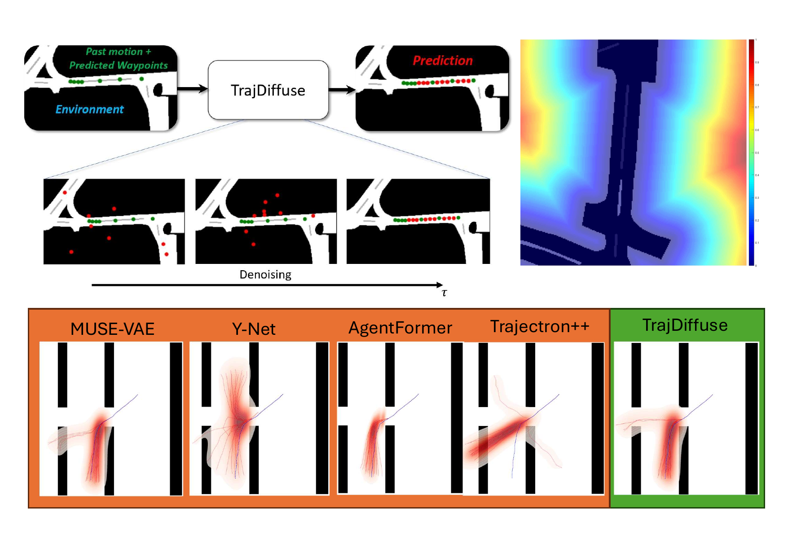
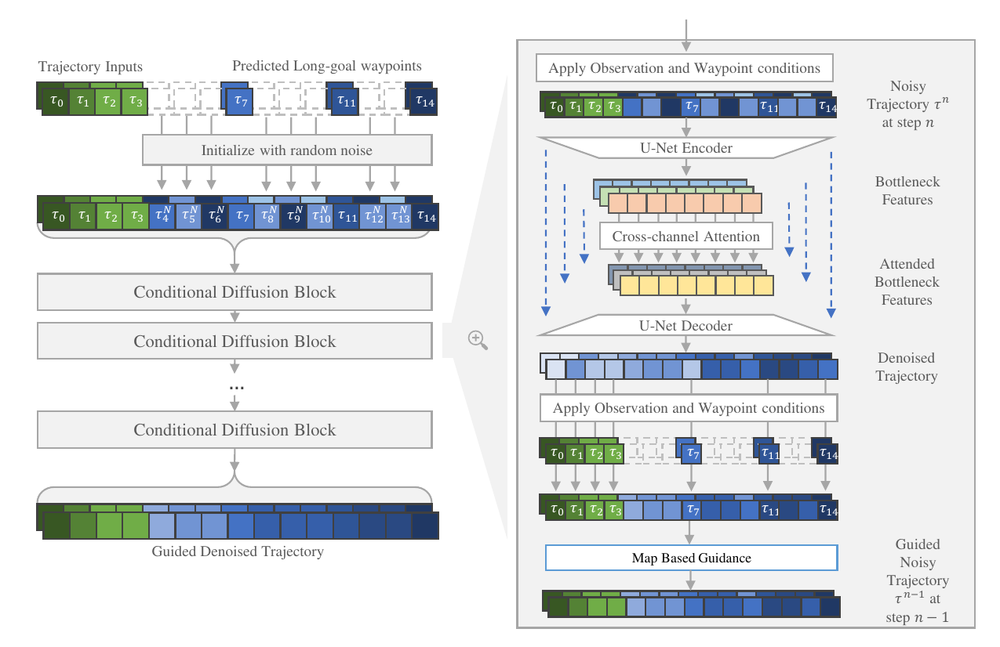

# TrajDiffuse: A Conditional Diffusion Model for Environment-Aware Trajectory Prediction
Official Repository for [TrajDiffuse: A Conditional Diffusion Model for Environment-Aware Trajectory Prediction](https://arxiv.org/pdf/2410.10804)
Published at 2024 International Conference on Pattern Recognition (ICPR)
> Qingze (Tony) Liu, Danrui Li, Samuel S. Sohn, Sejong Yoon, Mubbasir Kapadia, and Vladimir Pavlovic

## Overview

<table>
  <tr>
    <td></td>
    <td></td>
  </tr>
</table>

## Data Preparation

**NOTE:** To use our pre-processed dataset, please download from the mentioned link below or go to release of the github repo.

### PFDS Dataset:

+ The preprocessed PFSD dataset is attached in [this link](https://github.com/TL-QZ/TrajDiffuse/releases/download/ICPR/PFSD.zip). 

+ Place the unzipped pkl files under the datasets/pfsd directory as follows.

```bash
datasets
    |- pfsd
```

### NuScenes Dataset:

+ We follow the convention of the AgentFormer repo when processing NuScenes dataset. Please refer to [their repo](https://github.com/Khrylx/AgentFormer) for more detail.

+ We also provde preprocessed NuScenes data that was used for our work in [this link](https://github.com/TL-QZ/TrajDiffuse/releases/download/ICPR/nuScenes.zip). 

+ Once unzip the preprocessed data, place the files in dataset/nuScenes directory as follows

```bash
datasets
    |- nuScenes
        |-label
        |-map_0.1
```

## Training models

+ You can use the scripts starting with `train` under `scripts/${dataset_name}` to train each of the network.
```bash
bash scripts/{pfsd OR nuScenes}/train_lg_cvae.sh
bash scripts/{pfsd OR nuScenes}/train_sg_net.sh
bash scripts/{pfsd OR nuScenes}/train_diffuse.sh
```

## Evaluations and Metric Implementations

**NOTE:** To use our pre-computed trajectory caches, please download from the mentioned link below or go to release of the github repo.

### Cache Model Output (Pre-computed cache included)

+ First, cache the model output using either `output_script_pfsd.py` or `output_script_nuScenes.py`
```bash
python output_script_pfsd.py
python output_script_nuScenes.py
```

+ **Note:** This script will cache output from Muse-VAE, TrajDiffuse w/o guidance and Full TrajDiffuse with map-based guidance
+ The map guidance requires extra backpropergation steps during inference for gradient computation, therefore it will take longer time to run under current implementation. We left the speeding up the infernece process as future work.

+ **Pre-computed Model Outputs:** We provde the replicated trajectorys for all models including ours in [this link](https://github.com/TL-QZ/TrajDiffuse/releases/download/ICPR/Model_output_for_paper.zip). Download and unzip them into:
```bash
Model_output_for_paper
    |-nuscenes
    |-pfsd
    ...
```

### Metric Evaluation

+ Once unzip/copy the precomputed trajectories from each models into the folder `Model_output_for_paper`, use the following scripts
+ For PFSD, the evalution is included in `eval_script_for_paper_PFSD.ipynb`
+ For PFSD, the evalution is included in `eval_script_for_paper_nuScenes.ipynb`
